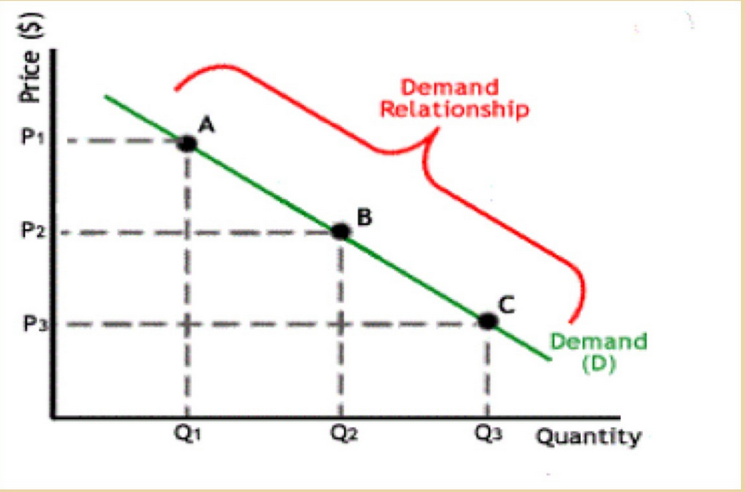
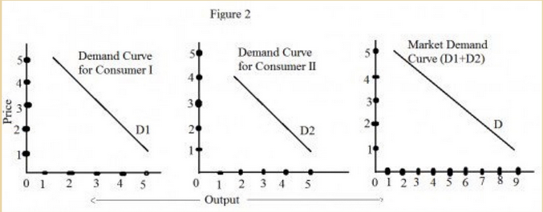
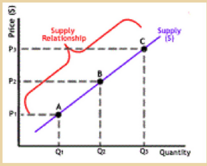

## Definition
- the science of logically oriented human beings:
	- with unlimited wants
	- limited resources
- the study of how individuals and societies choose to use the scarce resources that nature has provided to use
- it is the study of **how people make choices**

---
## Branch of economics
- Microeconomics
	- deals with functioning of
		- individual, households
		- industries, firms
	- and the behaviour of above-mentioned individual economic decision making units
	- firm's choices about what to produce and how much to charge, and households' choices about what and how much to buy, helps to explain why the economy produces the things it does.
	- sees and examines the **trees**
- Macroeconomics
	- it is the study of aggregates
	- instead of understanding what determines the o/p at individual level, macroeconomics examines the factors that determine national o/p, national product
	- sees and analyses the **forest**

---
## Economic policy
- Every action taken by any country's government to influence its economy is termed as a part of it's economic policy
- **1951 five year plans**
- **1965 green revolution**
- Objective (GEES)
	- Efficiency
		- an efficient economy is one that produces what people want at the least possible cost. if the system allocates resources to the production of things that nobody wants, it is inefficent
	- Equity
		- a more equal distribution of income and wealth
		- it is a **technical concept** as equity may imply poverty alleviation, but the extent ot which the poor should receive cash benefits from the gov. is the subject of enormous disagreement
	- Growth
		- economic growth is an increase in the total o/p of an economy. if output grows faster than the pop., o/p per capita rises and standards of living increase
	- Stability
		- refers to the condition in which national output is growing steadily considering:
			- low inflation
			- full employment
		- of resources

---
## Market Forces and Demand
- Market forces
	- theory of demand and supply
	- considers how buyers and sellers react and how they interact with each another
	- shows how supply and demand determine prices in a market economy and how prices, in turn, allocate the economy's scarce resources
- Demand
	- willingness to buy/purchase
	- quantity demanded of any good is the amount of good that buyers are willing and able to produce
	- determined on **the price of good**
	- Law of demand
		- quantity demanded is inversely related to price all other factors remain same
		- always certain exceptions to the law
	- **Ceteris peribus**
		- Other things being equal
	- 

---
## Concept of Demand
- Market Demand vs Individual Demand
	- Market Demand is the sum of all individual demands
	- 
	- the market demand curve shows how the quantity demanded of a good varies as the price of the good varies, while all the factors that affect how much consumers want to buy are held constant
- Shift in Demand Curve
	- A new demand curve is obtained
	- Increase in demand
		- Any change that increases the quantity demanded at every price shifts the demand curve to the right
	- Decrease in demand
		- Any change that reduces the quantity demanded at every price shifts the demand curve to the left
- Variables affecting shift in demand curve
	- **Income**
		- Normal goods
			- A good for which, other things equal, an increase income leads to an increase in demand
			- eg. eating outside will increase with increase in income
		- Inferior goods
			- A good for which, other things equal, an increase in income leads to a decrease in demand
			- eg. consumption of salt may decrease or would remain constant with increase in income
	- **Substitute Goods**
		- Two goods for which increase in the price of one leads to an increase in the demand for the other
		- eg. If coke price increases, pepsi demand increase. This will shift the demand curve for Pepsi to right
	- **Complementary Goods**
		- Two goods for which increase in price of one leads to a decrease in the demand for the other
		- eg. price of car decrease, demand for petrol will rise, rightward shift for petrol to right
	- **Taste & Preference**
		- eg. I started eating non-veg. instead of veg.
	- **Expectation**
		- Expectations about the future may affect the demand for a good or service today
		- eg. Stock market
	- **Number of Buyers**
- Exception to Law of Demand
	- **Giffen Goods**
		- Those goods that do not comply with law of demand
		- quantity demanded proportional to price
	- **Natural Calamities**
		- emergency situations, prices hardly matters
	- **Fashionistas**
		- branded products
	- **Anticipation of Prices**
		- buying more if further price may increase

---
## Concept of Supply
- Willingness / desire to sell
- The quantity supplied of any good is the amount that sellers are willing and able to sell
- Quantity supplied is directly proportional to the price of the good
- Law of supply
	- Other things remain equal, when the price of a good rises, the quantity supplied of the good also rises, and vice versa
	- 
- Individual Supply vs Market Supply
	- Market supply is the sum of all individual supplies
	- the total quantity supplied at any price, the individual quantities found on the horizontal axis of the individual supply curves are added
- Shift in Supply Curve
	- A new supply curve is obtained
	- Increase in Supply
		- Any change that:
			- raises quantity supplied
			- at every or any price
			- shifts the supply curve to the right
	- Decrease in Supply
		- Any change that:
			- reduces the quantity supplied
			- at any and every price
			- shifts the supply curve to the left
- Variables Affecting Supply Curve
	- **Input Prices**
		- Supply of a good is negatively related to the price of the inputs
		- eg. If price of raw materials used for making cake increase, producing cake is less profitable, supply decreases
	- **Technology**
		- eg. Machines used for making cakes. If technology is good, it reduces other costs, more profitable, supply increase
	- **Expectations**
		- Supplying more later thinking price would rise
		- eg. During christmas, business would store cakes in storage so that when price rise they can get profits
	- **Number of sellers**
		- More the number of sellers, more compteition, price is generally low
		- eg. if producers of cake were to stop producing and retire from the cake business, the supply in market would fall
- Exceptions to the law of supply
	- **Expectations of future prices**
		- a supplier's behaviour changes with future prices
		- whatever the price may be presently producers may want to supply the goods when the prices rise even more which would get them good returns
		- woollen clothes highest supply in winters
	- **Weather dependant produce from farms**
		- if weather seems bad, products are not produced
	- **Perishable commodities**
		- which perish in small time
		- they need to be supplied before they perish
		- sell entire stock asap
		- eg. fruits
	- **Fashionista**
		- when you sell goods which are in fashion then the sellers command a higher price
	- **Economic slowdown**
		- Businees pass thru different economic phases like
			- slowdown
			- recession
			- depression
		- sellers have to adapt to these changes accordingly
	- **Modification change in businees**
		- seller can plan to diversifyy and enter into an entirely new segment of business by exiting/continuing the present one
	- **Requirement of money/funds**
		- seller sell immediately even at lower prices as money needed
	- **Supply of Labour**
		- if the labour is willing to work, the firm will get the maximum benefit out them

---
## Point of equilibrium
- the point at which market demand and market supply curve meet
- price -> **Equilibrium price**
- quantity -> **Equilibrium quantity**
- Cases
	- Surplus or Excess Supply
	- Shortage or Excess Demand